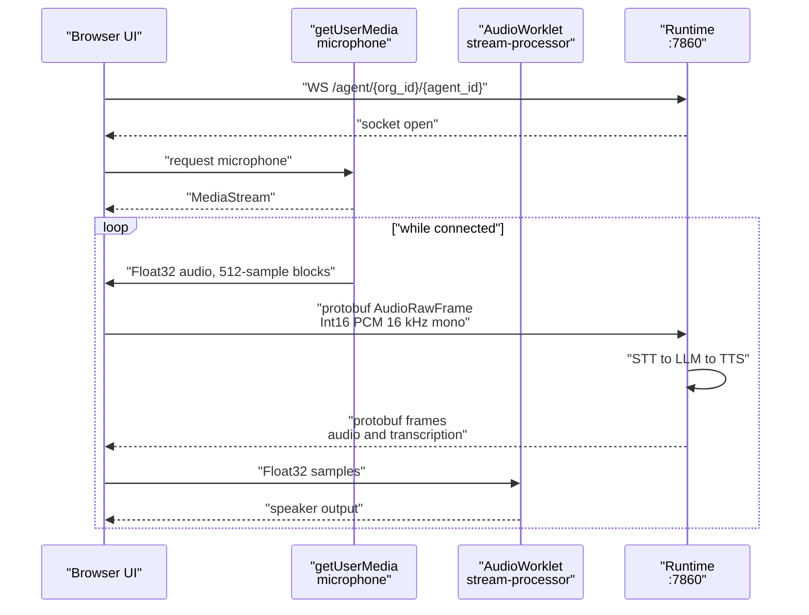

# Browser test calls

The dashboard can talk to an agent through your laptop's microphone and speakers — no phone number, no telephony provider, no public URL. This is the one capability the dashboard has that the REST API does not, and it is the fastest way to hear whether a prompt, a voice, or a language choice actually works.


The dashboard is **Beta**. It lives on the `dev-frontend` branch, is not merged into `dev`, and is not part of the Docker Compose stack. You run it separately against a running API.


## What a browser test call is

A live, bidirectional audio session between your browser and the [runtime](../services/runtime.md), running the same STT → LLM → TTS pipeline a real caller would hit. Your microphone replaces the phone line; the runtime's telephony frame serializer is replaced by Pipecat's protobuf serializer.

You reach it from two places, both rendering the same `CallStage.tsx` component:

* **`AgentTestModal.tsx`** — the Test action on a `websocket` agent's card on `/dashboard`. It shows the call stage next to a summary of the agent's language, STT, TTS, voice, LLM and model.
* **`TestCallStep.tsx`** — the final step of the [agent creation wizard](agent-wizard.md). It creates the agent first, then connects to the id that comes back.

The stage shows connection status, a call timer, mute and speaker-mute controls, and live captions as the transcript arrives.

## Requirements

| Requirement | Why |
| --- | --- |
| An agent with `agent_category` of `websocket` | The runtime returns a telephony media path for `telephony` agents. `AgentsHome.tsx` branches on this field and offers `telephony` agents an outbound phone call instead. |
| The runtime reachable at `NEXT_PUBLIC_RUNTIME_WS_URL` | Default `ws://localhost:7860`. See [Running the dashboard](running.md). |
| Provider credentials configured | The runtime loads them from the API. Without them the pipeline cannot start. |
| Microphone permission | Requested via `getUserMedia` after the socket opens. |
| A secure context or localhost | Browsers only grant microphone access on HTTPS or `localhost`. |

To make a `websocket` agent in the wizard, leave the delivery dropdown on its default — "WebSocket — browser test". Selecting a telephony provider makes it a `telephony` agent instead. Categories are covered in [Agents and agent categories](../../guides/concepts/agents.md).

## The audio path



**Capture.** `usePipecatAudio.ts` opens an `AudioContext` with `sampleRate: 16000` and `latencyHint: "interactive"`, then requests a mono microphone stream with echo cancellation and noise suppression on. A `ScriptProcessorNode` with a 512-sample buffer reads each block, `convertFloat32ToS16PCM()` clamps and scales it to signed 16-bit, and the result goes out as a protobuf frame.

**Playback.** `frontend/public/stream-processor-worklet.js` registers an `AudioWorkletProcessor` named `stream-processor`, loaded with `ctx.audioWorklet.addModule("/stream-processor-worklet.js")`. Incoming audio bytes are converted back to Float32 by `int16BytesToFloat32()` and posted to the worklet, which queues them in 128-sample chunks and drains one per render quantum. Running playback on the audio thread is what keeps it from stuttering when the main thread is busy. The worklet also supports `clear` and `interrupt` messages, so a barge-in drops the queued audio rather than talking over you.

The sample rate is 16000 on both ends. That matches `WEBSOCKET_SAMPLE_RATE`, whose default is `16000` in `apps/runtime/README.md` — distinct from `SAMPLE_RATE`, the telephony rate, which defaults to `8000`.

## How it connects

One WebSocket, to the same route telephony uses. The runtime dispatches on the agent's `agent_category`, so the path does not change:

```text
{NEXT_PUBLIC_RUNTIME_WS_URL}/agent/{org_id}/{agent_id}
```

`org_id` comes from the stored session, `agent_id` from the agent being tested. There is no handshake message and no auth token on this socket — the runtime resolves the agent from the path and loads its config and provider credentials from the API itself.

Frames are Pipecat protobuf, encoded in the browser by `protobufjs` 8. The hook embeds the `.proto` schema as a string literal and parses it at mount with `protobuf.parse()`, so no `.proto` file is fetched at runtime. The `Frame` message is a `oneof` over five types:

| Frame | Direction | Carries |
| --- | --- | --- |
| `AudioRawFrame` | both | `audio` bytes, `sample_rate`, `num_channels` |
| `TranscriptionFrame` | inbound | `text`, `user_id`, `timestamp` |
| `TextFrame` | inbound | `text` |
| `MessageFrame` | inbound | a JSON string in `data` |
| `InterruptionFrame` | both | barge-in signal |

Transcript routing uses `user_id`: anything that is not `bot` or `ai` is attributed to you and appended to the history; anything else is treated as the agent's in-progress speech and shown as a live caption. `MessageFrame` payloads are parsed as JSON and handled by their `type` — `bot-tts-text`, `bot-output` and `generated_text` accumulate the agent's caption, `user-transcription` and `transcription` push a user line, and `bot-stopped-speaking` commits the accumulated caption to the transcript history and marks playback finished.

Decode failures and non-JSON message frames are swallowed silently, so an unfamiliar frame type will not break the call — but it will not appear either.

On disconnect the hook stops microphone tracks, disconnects the worklet and gain nodes, closes the `AudioContext`, and clears the socket. It also runs this on unmount, so navigating away always releases the microphone.

## Limitations


**Browser test calls are recorded.** The runtime registers a `call_type: web` CallLog on connect, so a transcript and recording are stored under the same MinIO paths as telephony calls. The captions shown during the call, however, live only in React state and are gone when you close the modal — read the stored transcript through `GET /api/v1/calls/{call_id}/transcript`.


Other constraints worth knowing:

* **Telephony agents cannot take a browser call.** The runtime expects a provider `start` event on that socket. Use `POST /calls/outbound` and a real phone instead.
* **No authentication on the socket.** Anyone who can reach the runtime port and knows an `org_id` and `agent_id` pair can open a session. Do not expose port 7860 publicly without a proxy that authenticates. See [Security hardening](../../guides/deployment/security-hardening.md) and [Public voice URLs](../../guides/deployment/public-voice-urls.md).
* **Capture uses `ScriptProcessorNode`**, which is deprecated in favour of `AudioWorklet`. It works in current browsers but runs on the main thread, so heavy page activity can affect capture. Playback already uses the worklet.
* **`AudioContext` is requested at 16 kHz.** Browsers may not honour the requested rate; the code reads back `ctx.sampleRate` when queueing playback rather than assuming it.
* **Microphone denial is silent past the status line.** Refusing permission sets the status to "Microphone access denied", but the socket stays open and the agent may still greet you into a call it cannot hear.
* **A test call in the wizard creates a real agent.** The Test call step calls `POST /agents` before it can connect. Abandoning the wizard afterwards leaves the agent in your organisation.

If you want a persisted transcript and recording, place a telephony call instead — those artifacts are written to MinIO at call end and exposed through `GET /calls/{call_id}/transcript` and `GET /calls/{call_id}/recording`. See [Calls and call artifacts](../../guides/concepts/calls.md).

## Related

* [Browser WebSocket agents](../clients/browser-websocket.md)
* [Agent creation wizard](agent-wizard.md)
* [Dashboard tour](dashboard-tour.md)
* [Agents and agent categories](../../guides/concepts/agents.md)
* [Runtime (apps/runtime)](../services/runtime.md)
* [WebSocket API](../../api-reference/websocket-api.md)
