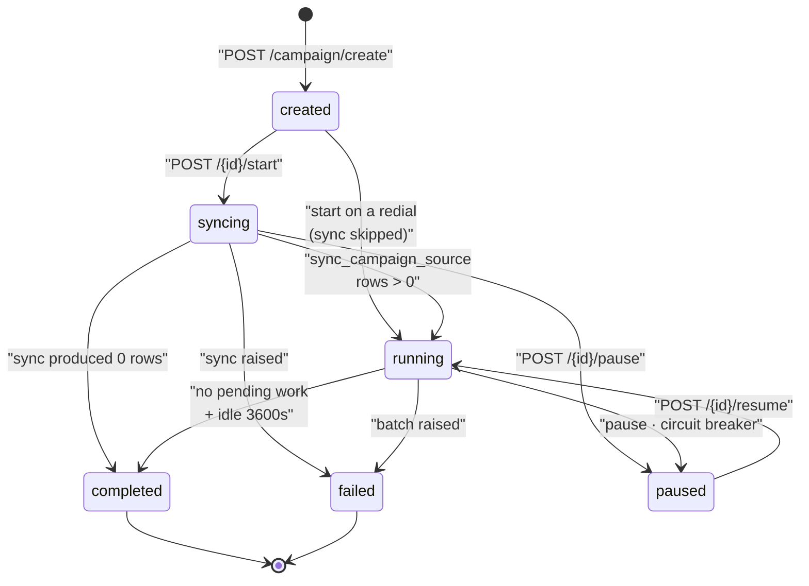
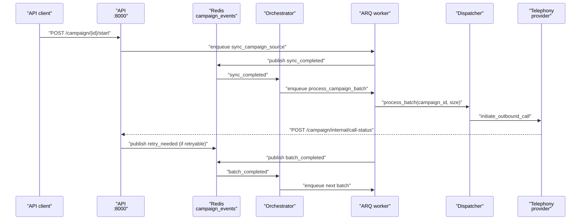
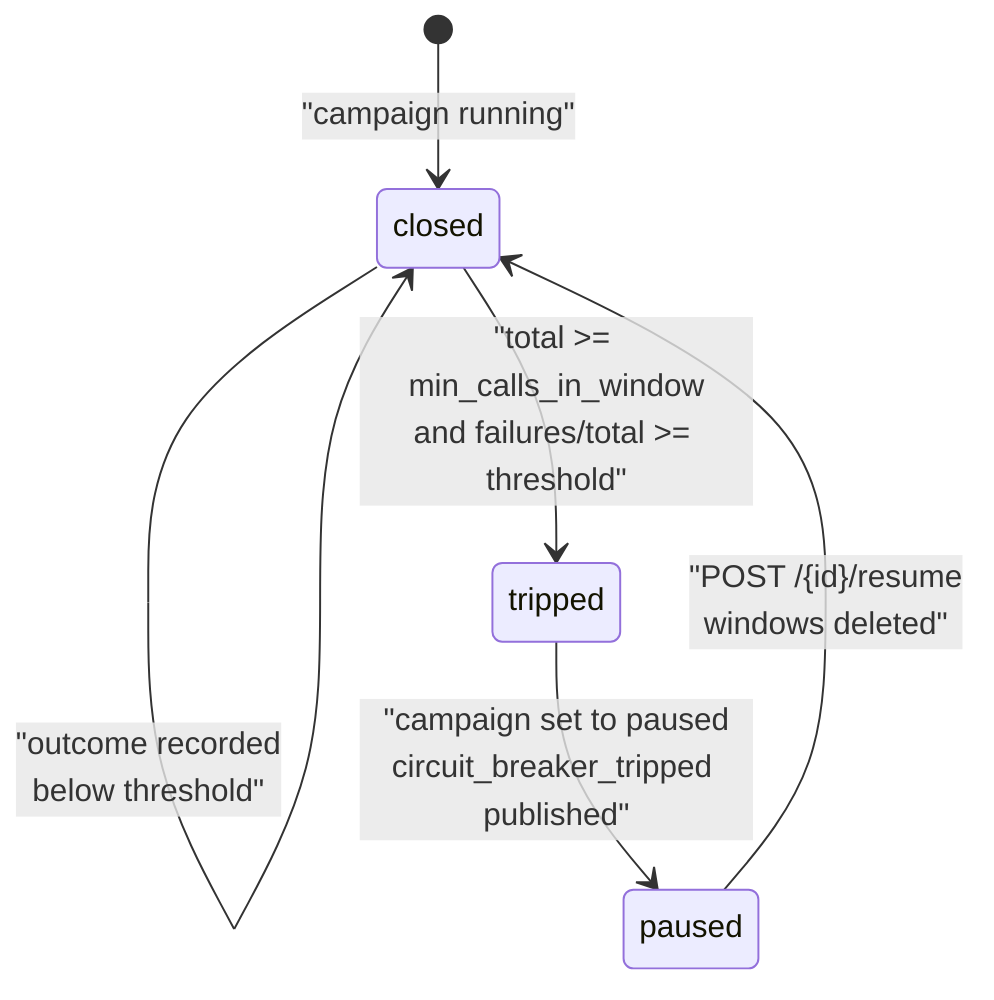

# Campaigns

A campaign turns a CSV of phone numbers into a controlled stream of outbound calls placed by one [telephony agent](agents.md). This page explains the moving parts — the orchestrator, the ARQ worker, the dispatcher, retries, and the circuit breaker — and what each of them reads and writes.


If you only want to run one, start with [Running a campaign](../operator/running-a-campaign.md). This page is the mechanism behind it.


## What a campaign is

A campaign is one document in the `Campaigns` collection plus one `QueuedRuns` document per contact per attempt. The campaign holds configuration and counters; each queued run holds one contact's context variables and its own state.

| Field | What it holds |
| --- | --- |
| `campaign_id` | UUID, unique index. |
| `org_id`, `agent_id` | Owning organisation and the telephony agent that places the calls. |
| `source_type`, `source_id` | `"csv"` and the MinIO object key of the uploaded file. |
| `state` | One of six values — see [Campaign states](#campaign-states). |
| `total_rows`, `processed_rows`, `failed_rows` | Progress counters. |
| `rate_limit_per_second` | Calls per second, 1–20, default 1. |
| `retry_config` | See [Retry policy](#retry-policy). |
| `orchestrator_metadata` | `max_concurrency`, `schedule_config`, `circuit_breaker`, `counters`, and `parent_campaign_id` for redials. |
| `from_number` | Optional caller ID override. |
| `logs` | Append-only array of `{timestamp, level, event, message, details}`. |

Campaign creation is validated in `apps/api/app/routers/campaign.py`. The agent must have `agent_category == "telephony"` and at least one phone number attached, otherwise `POST /campaign/create` returns 422.

## CSV upload and source sync

Uploading and creating are two separate calls.

1. `POST /campaign/upload` takes a multipart CSV. It rejects non-`.csv` filenames, empty bodies, and anything over `settings.CAMPAIGN_MAX_CSV_BYTES` (5 MB by default). The file is stored in MinIO under `campaigns/{org_id}/{uuid}_{filename}` and that key comes back as `source_id`.
2. `POST /campaign/create` takes that `source_id` and validates the file again before persisting the campaign.

Validation lives in `CampaignSourceSyncService.validate_source_data` in `apps/api/app/services/campaign/source_sync.py` and applies to every source type:

* Headers are lowercased and stripped. A `phone_number` column is required.
* Every non-empty phone number must start with `+`. Invalid rows are reported by row number (header is row 1), first five shown.
* Duplicate phone numbers are rejected, again by row number.

Every other column becomes a context variable available to the agent during the call.

Actual ingestion happens later, off the request path. When the campaign starts, the ARQ task `sync_campaign_source` calls `CSVSyncService.sync_source_data`, which re-reads the object from MinIO and bulk-inserts one `QueuedRuns` document per row with a `source_uuid` of `csv_{md5(file_key)[:8]}_row_{n}`. Rows with an empty `phone_number` are skipped, and `total_rows` is set to the number of runs actually created.

`source_sync_factory.get_sync_service` only knows `"csv"`. Any other `source_type` raises `ValueError`. The abstraction exists for future sources; there is one today.

## Campaign states

`CampaignState` is a `Literal` in `apps/api/app/models/schemas.py` with exactly six values: `created`, `syncing`, `running`, `paused`, `completed`, `failed`.

Transitions are enforced in `runner.py`: start requires `created`, pause requires `running` or `syncing`, resume requires `paused`. Anything else returns 400. Resuming also calls `circuit_breaker.reset(campaign_id)`, which deletes the Redis failure and success windows — so a resumed campaign starts the breaker from zero.

There is no transition out of `failed`. A campaign that a batch pushed to `failed` cannot be resumed through the API — create a new campaign or a [redial](#redial).

## The orchestrator loop

The orchestrator is a separate container (`campaign-orchestrator`) running `campaign_orchestrator.py`. It never places calls. It decides *when* the next batch should be enqueued and *when* a campaign is finished.

It runs two concurrent tasks:

* **`_listen_for_events`** — subscribes to the Redis pub/sub channel `campaign_events` (`CAMPAIGN_EVENTS_CHANNEL` in `apps/api/app/constants/campaign.py`) and reacts to each event.
* **`_monitor_completion`** — wakes every `completion_check_interval` seconds (60) and sweeps every campaign in state `running`.

On the event side:

| Event | Orchestrator response |
| --- | --- |
| `sync_completed` | Schedule the first batch. |
| `batch_completed` | Clear `_batch_in_progress`, re-read the campaign, and schedule the next batch if it is still `running`. |
| `batch_failed` | Clear `_batch_in_progress` and stamp last activity. Nothing is rescheduled. |
| `retry_needed` | Create a delayed retry `QueuedRuns` document — see [Retry policy](#retry-policy). |
| `circuit_breaker_tripped` | Drop all in-memory state for the campaign. |

`_schedule_next_batch` is the gate every batch passes through. In order, it:

1. Takes a 5-second in-process lock keyed by `campaign_id`, so a burst of events cannot enqueue two batches at once.
2. Re-reads the campaign and bails unless the state is `running` or `syncing`.
3. Checks `_is_within_schedule`. If `orchestrator_metadata.schedule_config.enabled` is true, the current weekday and `HH:MM` in the configured `timezone` must fall inside one of the `slots` (`day_of_week` 0 = Monday). An unparseable timezone fails open — the campaign runs.
4. Asks the circuit breaker whether the circuit is open. If it is, the campaign is set to `paused` and a `circuit_breaker_tripped` event is published.
5. Checks `_has_pending_work` — queued runs due now, or any run still `processing`.
6. Enqueues `process_campaign_batch` with `settings.CAMPAIGN_BATCH_SIZE`, records `_batch_in_progress[campaign_id]`, and stamps `last_batch_scheduled_at` and `last_activity_at`.


`_processing_locks`, `_last_activity`, and `_batch_in_progress` are plain Python dicts on the orchestrator instance. They are not shared state — run exactly one orchestrator container. Two would each schedule batches for the same campaign.


## Batches and the ARQ worker

The worker is another container running `arq` against `WorkerSettings` in `apps/api/app/tasks/arq.py`:

| Setting | Value |
| --- | --- |
| `functions` | `sync_campaign_source`, `process_campaign_batch` |
| `max_jobs` | 10 |
| `conn_timeout` | 10 |
| `redis_settings` | Derived from `REDIS_URL`; TLS when the scheme is `rediss` |

Batch size comes from `settings.CAMPAIGN_BATCH_SIZE` (environment variable `CAMPAIGN_BATCH_SIZE`, default 10).

`process_campaign_batch` in `apps/api/app/tasks/campaign_tasks.py` delegates to the dispatcher and then publishes exactly one event:

* Success → `batch_completed` with the processed count. If anything was processed, the `phone_number_pool_exhausted_attempts` counter resets.
* `ConcurrentSlotAcquisitionError` → `batch_failed`, campaign set to `failed`, and the job re-raises.
* `PhoneNumberPoolExhaustedError` → increments `phone_number_pool_exhausted_attempts`. Below `MAX_PHONE_POOL_ATTEMPTS` (3) it publishes `batch_completed` with zero processed, which makes the orchestrator try again later. On the third attempt it publishes `batch_failed` and sets the campaign to `failed`.
* Any other exception → `batch_failed` and campaign `failed`.

The full end-to-end path for one contact:

## The dispatcher and from-number pooling

`CampaignCallDispatcher.process_batch` in `campaign_call_dispatcher.py` claims work and places calls.

Claiming is atomic. `claim_queued_runs_for_processing` issues one `find_one_and_update` per run, flipping `state` from `queued` to `processing` and stamping `claimed_at`, ordered by `scheduled_for` then `created_at`. Two workers cannot claim the same run.

For each claimed run the dispatcher then:

1. Waits on the per-second token bucket (`rate_limiter.acquire_token`) polling every 50 ms.
2. Acquires a concurrency slot with `CONCURRENT_SLOT_TIMEOUT = 120.0` seconds — see [Call concurrency](call-concurrency.md).
3. Resolves a caller ID and places the call.
4. Marks the run `processed` with the resulting `call_id` and increments `processed_rows`.

Caller ID resolution (`_resolve_from_numbers`) is ordered: an explicit `campaign.from_number` wins outright; otherwise the agent's `linked_phone_number` comes first, followed by every `PhoneNumbers` document assigned to that agent.

The pool then behaves differently depending on how many numbers there are, per `_uses_exclusive_from_number_pool`:

* **One number** — used directly, shared across concurrent calls, no pool bookkeeping.
* **More than one** — a Redis sorted set `from_number_pool:{org_id}:agent:{agent_id}` holds each number with score 0 (free) or a timestamp (in use). A Lua script releases entries older than `stale_call_timeout`, picks a random free number, and marks it busy. If none is free, `acquire_from_number` returns `None` and the dispatcher raises `PhoneNumberPoolExhaustedError`.

Failures during a batch are handled two ways. A per-run exception marks that one run `failed` and the loop continues. `PhoneNumberPoolExhaustedError`, `ConcurrentSlotAcquisitionError`, and cancellation abort the whole batch — `_return_unprocessed_claims` flips every still-unprocessed claimed run back to `queued`, but only where `call_id` is still null, so a run that already produced a call is never re-dialled.

## Retry policy

Defaults live in `DEFAULT_CAMPAIGN_RETRY_CONFIG` in `apps/api/app/constants/campaign.py`:

| Key | Default | Meaning |
| --- | --- | --- |
| `enabled` | `true` | Master switch. |
| `max_retries` | `2` | Additional attempts per contact, 0–10. |
| `retry_delay_seconds` | `120` | Wait before the retry becomes due, 30–3600. |
| `retry_on_busy` | `true` | Retry a `busy` disposition. |
| `retry_on_no_answer` | `true` | Retry a `no_answer` disposition. |
| `retry_on_voicemail` | `false` | Retry a `voicemail` disposition. |

The trigger is `POST /campaign/internal/call-status`, called by the runtime with the internal API key when a call reaches a terminal state. It routes to `handle_call_terminal` in `status_processor.py`, which:

1. Releases the call's concurrency slot and its from-number.
2. Records the outcome with the circuit breaker. `FAILURE_RESPONSES` is `busy`, `no_answer`, `voicemail`, `failed`, `cancelled`.
3. If the disposition is in `RETRYABLE` (`busy`, `no_answer`, `voicemail`, `failed`) and the campaign's retry config allows it, publishes `retry_needed`.

The orchestrator does the work. `_handle_retry_event` re-checks the same config, loads the parent queued run, and compares `retry_count` against `max_retries`. When the cap is reached it increments `failed_rows` and stops. Otherwise it creates a new `QueuedRuns` document with:

* `source_uuid` of `{parent_source_uuid}_retry_{n}`
* `retry_count` incremented, `parent_queued_run_id` set to the original
* `scheduled_for` set to now plus `retry_delay_seconds`
* context variables copied and extended with `is_retry`, `retry_attempt`, and `retry_reason`

Idempotency comes from the database, not the code. `QueuedRuns` carries a **unique** compound index `campaign_source_retry_unique` on `(campaign_id, source_uuid, retry_count)`, created in `apps/api/app/database_init.py`. A duplicate `retry_needed` event — a redelivered pub/sub message, a double webhook — cannot create a second retry row for the same attempt.

Two asymmetries are worth knowing. `cancelled` counts as a failure for the circuit breaker but is not in `RETRYABLE`, so a cancelled call is never retried. And `failed` *is* retryable even though `retry_config` has no per-reason switch for it — only `busy`, `no_answer`, and `voicemail` can be turned off individually.

## The circuit breaker

The breaker stops a campaign that is failing wholesale — a bad number list, a telephony outage, a misconfigured agent. Defaults are in `DEFAULT_CIRCUIT_BREAKER_CONFIG`:

| Key | Default | Meaning |
| --- | --- | --- |
| `enabled` | `true` | Master switch. |
| `failure_threshold` | `0.5` | Trip at a 50% failure rate, 0.1–1.0. |
| `window_seconds` | `300` | Sliding window length, 60–3600. |
| `min_calls_in_window` | `5` | Minimum calls before the rate is evaluated, 1–100. |

State lives in two Redis sorted sets per campaign, `cb_failures:{campaign_id}` and `cb_successes:{campaign_id}`, scored by timestamp. Both `record_call_outcome` and `is_circuit_open` run a Lua script that trims entries older than the window, counts what remains, and trips when `total >= min_calls` **and** `failures / total >= threshold`. Doing it in Lua keeps trim-count-decide a single atomic step, so two workers recording outcomes concurrently cannot read a half-trimmed window.

A separate list `cb_recent_failures:{campaign_id}` keeps the most recent failures for diagnosis, capped at `MAX_RECENT_FAILURES = 20` and expiring `window_seconds + 60` after the last write.

The breaker is evaluated at two points: on every terminal call outcome (`record_and_evaluate`, which pauses the campaign and appends a `circuit_breaker_tripped` log entry), and again before every batch is enqueued (`is_circuit_open` inside `_schedule_next_batch`). A campaign paused by the breaker stays paused until you resume it.

## Completion detection

There is no "last row" signal, so completion is inferred. Every 60 seconds `_check_stale_campaigns` walks every `running` campaign:

* If a batch has been in progress for more than 300 seconds, the entry is dropped and — if work remains — a new batch is scheduled. This is the recovery path for a worker that died mid-batch.
* If no batch is in progress and work remains, a batch is scheduled (subject to the schedule window).
* Otherwise `_should_mark_complete` runs.

`_should_mark_complete` returns true only when no batch is in progress, no queued run is pending or processing, **and** the last activity is older than `completion_timeout` (3600 seconds). Last activity comes from the in-memory `_last_activity` map, falling back to `last_activity_at`, `last_batch_scheduled_at`, then `started_at` on the document. The campaign is then set to `completed`, `completed_at` is stamped, and a `campaign_completed` event is published with the counters and elapsed duration.

The one-hour idle window exists so a pending retry — which may be scheduled up to an hour out — is not mistaken for an empty queue.

Because `_last_activity` is in memory, restarting the orchestrator falls back to the timestamps on the document. A campaign whose last batch was scheduled over an hour ago and has no pending work is marked `completed` on the first sweep after a restart.

## Progress and reporting

| Route | What it gives you |
| --- | --- |
| `GET /campaign/{id}/progress` | `state`, `total_rows`, `processed_rows`, `failed_rows`, `progress_percentage`, `rate_limit`, `started_at`, `completed_at`. |
| `GET /campaign/{id}/runs` | Call logs for the campaign, paginated (`limit` 1–500, default 50; `offset`). |
| `GET /campaign/{id}/report` | Streaming CSV of the first 500 call logs: `call_id`, `to_number`, `status`, `call_response`, `duration`, `created_at`. |
| `GET /campaign/{id}/source-download-url` | Presigned MinIO URL for the original CSV. |

`progress_percentage` is `processed_rows / total_rows * 100`, computed in `runner.get_campaign_status`, and is 0 when `total_rows` is 0.

The CSV report is capped at 500 rows in `apps/api/app/routers/campaign.py`. For a larger campaign, page through `GET /campaign/{id}/runs` instead.

The full route list is in the [REST API reference](../../api-reference/overview.md), and `/docs` on a running API is always current.

## Redial

`POST /campaign/{id}/redial` creates a **new** campaign targeting only the contacts whose calls did not connect.

`get_redial_candidates` reads the parent's call logs (up to 10,000) and collects every `call_id` whose `call_response` is one of `busy`, `no_answer`, `failed`, `cancelled`, `voicemail`, then finds the `QueuedRuns` linked to those calls. If none match, the route returns 400.

The child campaign copies the parent's agent, source, rate limit, retry config, and caller ID, and its `orchestrator_metadata.parent_campaign_id` points back at the parent. Its queued runs are created directly from the candidates' context variables with `source_uuid` values of `redial_{parent_campaign_id}_{n}`.

Because the rows already exist, `start_campaign` detects `parent_campaign_id` and skips the sync step entirely: it sets the campaign straight to `running` and publishes `sync_completed` itself, so the orchestrator schedules the first batch without the worker ever touching MinIO. This is the `created → running` edge in the state diagram.

## Related

* [Running a campaign](../operator/running-a-campaign.md) — the operator walkthrough
* [Workers and orchestrator](../../developer/services/workers.md) — the two containers this page depends on
* [Call concurrency and rate limiting](call-concurrency.md) — the slot the dispatcher waits for
* [Calls and call artifacts](calls.md) — what a dispatched call produces
* [Data model](../../developer/reference/data-model.md) — `Campaigns` and `QueuedRuns` in full
* [Campaign troubleshooting](../troubleshooting/campaigns.md)
