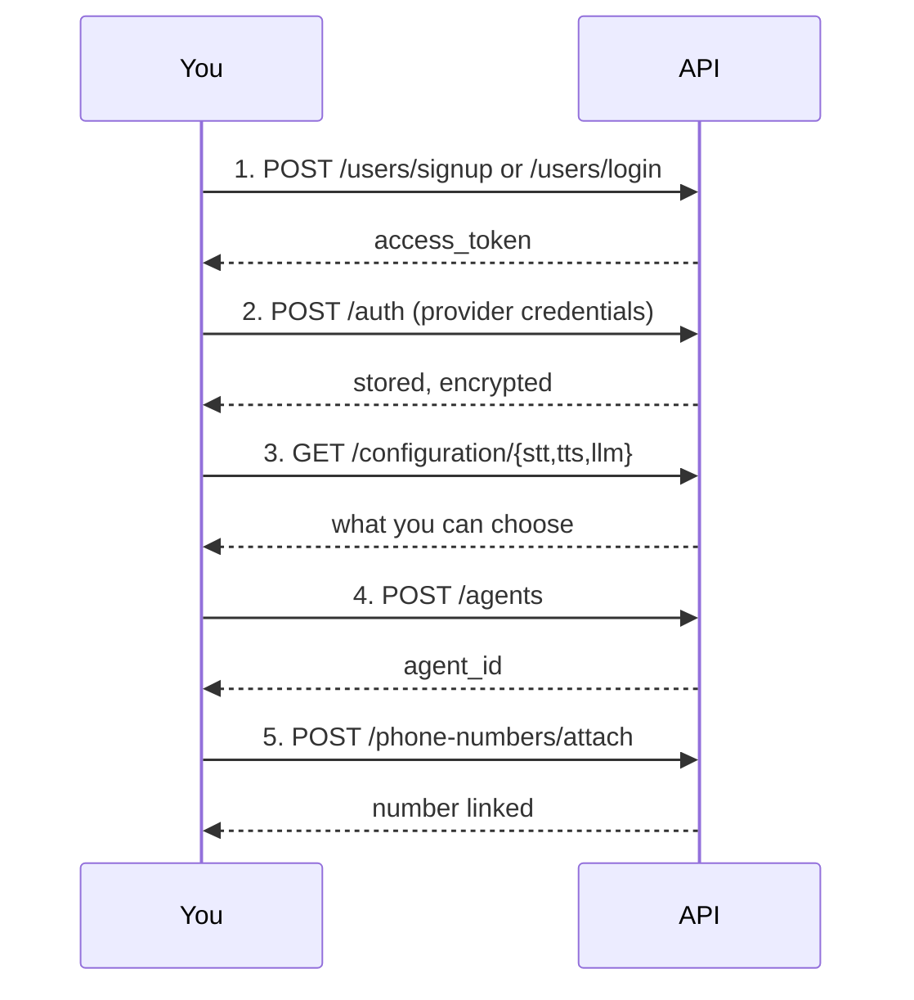

# Create your first agent

Six requests: sign in, store provider credentials, browse the catalogs, create an agent, and — for phone calls — attach a number. Every step is copy-pasteable.


Prefer clicking? [http://localhost:8000/docs](http://localhost:8000/docs) is the same API with a form for every endpoint.


## The flow



## 1. Get a token

```bash
export TOKEN=$(curl -s -X POST http://localhost:8000/api/v1/users/login \
  -H "Content-Type: application/json" \
  -d '{"email": "you@example.com", "password": "change-me"}' \
  | python3 -c "import sys,json; print(json.load(sys.stdin)['access_token'])")

echo "${TOKEN:0:20}..."
```

No account yet? Use `/users/signup` — see [Install and run](install-and-run.md).

## 2. Store provider credentials

Credentials are **provider-level**: one key set covers that vendor's STT, TTS, and LLM. Only secret fields are stored, and the blob is encrypted at rest.

```bash
curl -X POST http://localhost:8000/api/v1/auth \
  -H "Authorization: Bearer $TOKEN" \
  -H "Content-Type: application/json" \
  -d '{"provider": "openai", "auth": {"api_key": "sk-..."}}'
```

Repeat for each vendor you plan to use. To see what a provider expects:

```bash
curl -s -H "Authorization: Bearer $TOKEN" \
  http://localhost:8000/api/v1/auth/catalog/deepgram
```

Confirm what is configured:

```bash
curl -s -H "Authorization: Bearer $TOKEN" \
  http://localhost:8000/api/v1/auth/configured
```


Do this before creating an agent. The catalogs and any UI filter to providers you have credentials for, so an unconfigured provider looks like it does not exist.


## 3. Browse the catalogs

The catalogs are generated from the provider registry, so they always match what the code supports:

```bash
curl -s -H "Authorization: Bearer $TOKEN" http://localhost:8000/api/v1/configuration/stt
curl -s -H "Authorization: Bearer $TOKEN" http://localhost:8000/api/v1/configuration/tts
curl -s -H "Authorization: Bearer $TOKEN" http://localhost:8000/api/v1/configuration/llm
```

Each provider reports its required fields, which are secret, suggested models, and supported languages. For one provider's settings schema:

```bash
curl -s -H "Authorization: Bearer $TOKEN" \
  http://localhost:8000/api/v1/configuration/tts/setting/cartesia
```

## 4. Create the agent

Start with a `websocket` agent — no telephony account, no call charges, same pipeline.

```bash
curl -X POST http://localhost:8000/api/v1/agents \
  -H "Authorization: Bearer $TOKEN" \
  -H "Content-Type: application/json" \
  -d '{
    "name": "My First Agent",
    "agent_category": "websocket",
    "config": {
      "schema_version": 1,
      "prompts": {
        "system_prompt": "You are a helpful phone support agent. Keep replies to one or two sentences.",
        "greeting_message": "Hello! How can I help you today?"
      },
      "behaviour": {
        "interruption_min_words": 2,
        "user_silence_hangup_seconds": 30,
        "ignore_user_speech_before_greeting": true,
        "hold_messages": ["One moment please."],
        "hold_message_timeout_seconds": 0.6,
        "automatic_call_ending": {
          "enabled": true,
          "graceful_llm_call_ending": true
        }
      },
      "language": {"primary": "en", "secondary": []},
      "models": {
        "stt_config": {"provider": "deepgram", "model": "nova-3-general", "language": "en"},
        "tts_config": {"provider": "cartesia", "model": "sonic-3.5", "language": "en"},
        "llm_config": {"provider": "openai", "model": "gpt-4.1"}
      }
    }
  }'
```

Save the returned `agent_id`:

```bash
export AGENT_ID="paste-the-agent-id"
export ORG_ID=$(curl -s -H "Authorization: Bearer $TOKEN" \
  http://localhost:8000/api/v1/users/me \
  | python3 -c "import sys,json; print(json.load(sys.stdin)['org_id'])")
```


`config.models` takes **non-secret settings only**. API keys live in `ProviderAuth` from step 2 — putting one here fails validation with a 422 naming the field.

Two behaviour settings surprise people: `automatic_call_ending` needs **both** `enabled` and `graceful_llm_call_ending`, and `call_timeout_seconds` is accepted but never enforced. See [Agent configuration](../../developer/reference/agent-configuration.md).


## 5. For phone calls: a telephony agent

Two extra requirements: `VOICE_SERVER_BASE_URL` must be set in `.env`, and you need stored credentials for the telephony provider.

```bash
curl -X POST http://localhost:8000/api/v1/agents \
  -H "Authorization: Bearer $TOKEN" \
  -H "Content-Type: application/json" \
  -d '{
    "name": "Support Line",
    "agent_category": "telephony",
    "telephony_provider": "vobiz",
    "config": { "...": "same shape as above" }
  }'
```

On create the API provisions an application on your provider account and returns `telephony.application_id`. The answer URL is built from `VOICE_SERVER_BASE_URL` **at this moment** and stored with the provider.


Changing `VOICE_SERVER_BASE_URL` later does not update agents that already exist. See [Public voice URLs](../deployment/public-voice-urls.md).


## 6. Attach a number

```bash
curl -X POST http://localhost:8000/api/v1/phone-numbers/attach \
  -H "Authorization: Bearer $TOKEN" \
  -H "Content-Type: application/json" \
  -d '{
    "phone_number": "+15551234567",
    "provider": "vobiz",
    "agent_id": "'"$AGENT_ID"'"
  }'
```

Omit `agent_id` to import a number into inventory without linking it. To see what your provider account holds:

```bash
curl -s -H "Authorization: Bearer $TOKEN" \
  http://localhost:8000/api/v1/phone-numbers/providers/vobiz/inventory
```

## Check your work

```bash
curl -s -H "Authorization: Bearer $TOKEN" http://localhost:8000/api/v1/agents
curl -s -H "Authorization: Bearer $TOKEN" http://localhost:8000/api/v1/agents/$AGENT_ID
```

## Next

[Your first call](first-call.md) — talk to the agent you just made.
