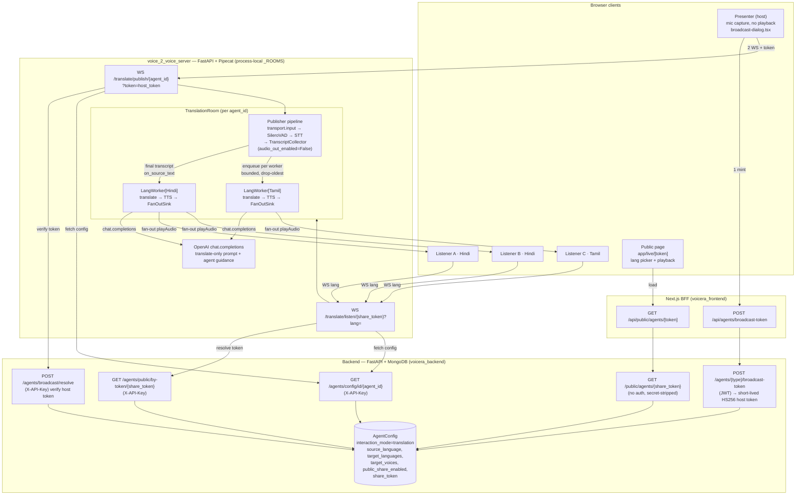
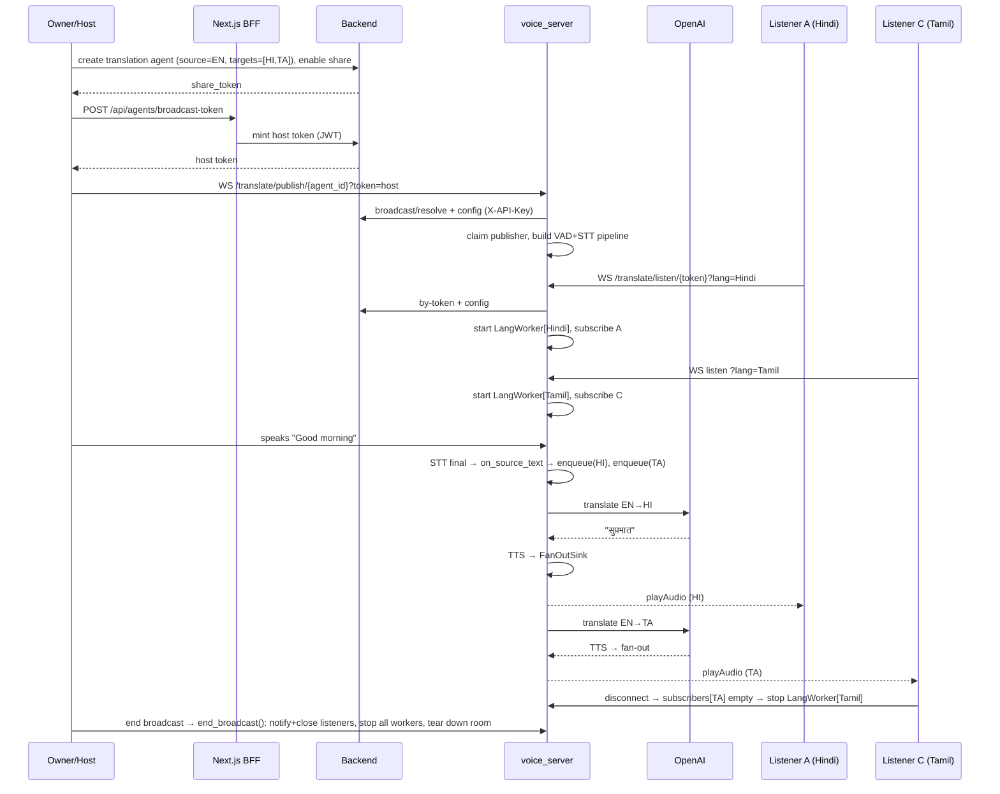

# Broadcast (Live Translation) — Architecture Diagram

One presenter speaks → many listeners hear a live translation in their chosen
language. Cost scales with **distinct active languages**, not listener count
(N listeners on one language share one translate→TTS stream).

## Component / dataflow



## Sequence (happy path)



## Key facts

- **Auth split:** public `share_token` = listen only. Publishing needs a
  short-lived HS256 **host token** (JWT-authed mint). `agent_id` never exposed
  publicly (would be a de-facto key on the unauthenticated WS routes).
- **Mute-bot is structural:** publisher pipeline has no LLM/TTS/output
  (`audio_out_enabled=False`), so the presenter inherently hears nothing back.
- **Lazy workers:** `LangWorker` starts on first listener of a language, stops
  when its last listener leaves. Capacity = 1 slot presenter + 1 per active
  language (not per listener).
- **Backpressure:** per-worker bounded `asyncio.Queue` (`MAX_SEGMENT_BACKLOG=50`),
  drop-oldest so a slow language stays near live speech, never back-pressures others.
- **Multi-worker caveat:** `_ROOMS` is process-local. With
  `VOICE_SERVER_NUM_WORKERS > 1`, presenter and listeners must land on the same
  worker — single-worker deploy or sticky routing on `/translate/*`.
```
