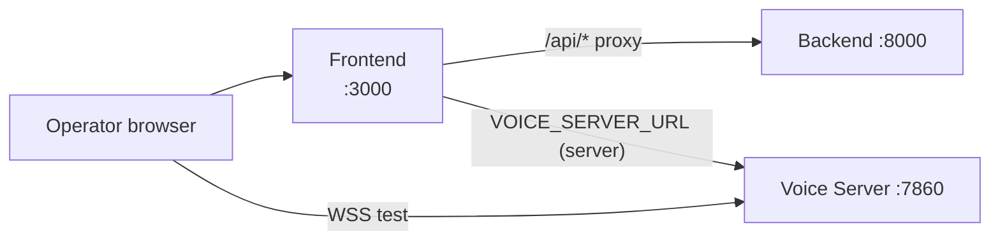

# Frontend

The Frontend is the operator dashboard. It is a Next.js application that talks to the Backend over HTTPS and, for the in-browser call test, opens a WebSocket directly to the Voice Server.

Default port: **3000**.

## Responsibilities

- Sign-in, organisation membership, profile
- **Assistants** (agents): create, edit, attach knowledge base, configure LLM / STT / TTS per agent
- **Integrations**: store provider API keys and Vobiz credentials at the org level
- **Phone numbers**: provision and attach Vobiz / Plivo numbers
- **Meetings / call history**: review transcripts, sentiment, recordings
- **Test on Browser**: live audio test against a configured agent
- Campaigns / batches (when enabled) and telemetry views

## Architecture

Next.js (App Router) with server components for protected pages. Client components handle the WebSocket audio test. The browser calls relative `/api/*` routes on the Frontend; those Next.js route handlers proxy to the Backend at `http://localhost:8000` (hardcoded in `lib/api-config.ts`, overridable via `API_URL` in Docker).



## Configuration

Copy `voicera_frontend/.env.example` to `.env.local`. Variables:

| Variable | Where | Purpose |
|----------|-------|---------|
| `NEXT_PUBLIC_JOHNAIC_SERVER_URL` | Client | Voice server base for Vobiz / Plivo answer URLs and **Test on Browser** (`http`→`ws`, `https`→`wss`) |
| `VOICE_SERVER_URL` | Server routes only | Outbound call proxy / telemetry (default `http://localhost:7860`) |
| `API_URL` | Docker Compose only | Override backend proxy target (e.g. `http://backend:8000`); local dev uses hardcoded `http://localhost:8000` |

Example `.env.local`:

```env
NEXT_PUBLIC_JOHNAIC_SERVER_URL=https://your-public-voice-host
VOICE_SERVER_URL=http://localhost:7860
```


`NEXT_PUBLIC_JOHNAIC_SERVER_URL` must be reachable from the operator's browser and from the telephony provider. See [guides/deployment/public-voice-urls.md](../guides/deployment/public-voice-urls.md).


## Endpoints / API surface

The Frontend itself does not expose a public REST surface beyond Next.js route handlers (auth helpers, server-side proxies). It consumes the Backend REST API documented in [reference/rest-api.md](../reference/rest-api.md).

## How it talks to other services

- **Backend** — primary HTTP target for all CRUD and auth. JWT sent as `Authorization: Bearer ...`.
- **Voice Server** — direct WebSocket from the browser for the **Test on Browser** feature; server-side routes optionally call `/outbound/call/`.
- **MinIO / MongoDB** — never accessed directly; always through the Backend.

## UI structure

Top-level sections in the dashboard sidebar:

| Section | Route | Backed by |
|---------|-------|-----------|
| Dashboard / overview | `/` | Backend analytics |
| Assistants | `/assistants` | `/api/v1/agents` |
| Phone numbers | `/numbers` | `/api/v1/telephony` |
| Integrations | `/integrations` | `/api/v1/integrations`, `/api/v1/custom-llm-integrations` |
| Knowledge base | `/knowledge-base` | `/api/v1/knowledge-base` |
| Meetings / calls | `/meetings` | `/api/v1/meetings` |
| Campaigns | `/campaigns` | `/api/v1/campaigns` |
| Settings | `/settings` | `/api/v1/auth`, org APIs |

Component conventions:

- `app/` — App Router routes; protected groups under `(dashboard)`
- `components/` — feature folders (assistants, campaigns, voice, analytics) + a `ui/` design system
- `hooks/` — `use-auth`, `use-voice`, `use-api`, etc.
- `lib/` — API client (`api.ts`), WebSocket helper (`websocket.ts`), constants

## Running



```bash
docker compose up -d frontend
# or
make start-all-services
```

Compose service: `frontend` on port `3000`. Uses `voicera_frontend/.env.local` at build and runtime.



```bash
cd voicera_frontend
cp .env.example .env.local
npm install
npm run dev
```

Or from the repo root: `make start-frontend`.



```bash
npm run build
npm run start
```



## Troubleshooting

- [troubleshooting/common-issues.md](../troubleshooting/common-issues.md)
- "Test on Browser" silent or fails to connect — verify `NEXT_PUBLIC_JOHNAIC_SERVER_URL` is reachable; use `https://` in production so the client connects via `wss://`.

## Next steps

- [guides/operator/dashboard-tour.md](../guides/operator/dashboard-tour.md)
- [guides/operator/operations.md](../guides/operator/operations.md)
- [services/backend.md](backend.md)
- [services/integrations.md](integrations.md)
